=== Лабораторная работа №1
1) Создаем проект C++ c main.cpp

.Работа программы с переменной unsigned short
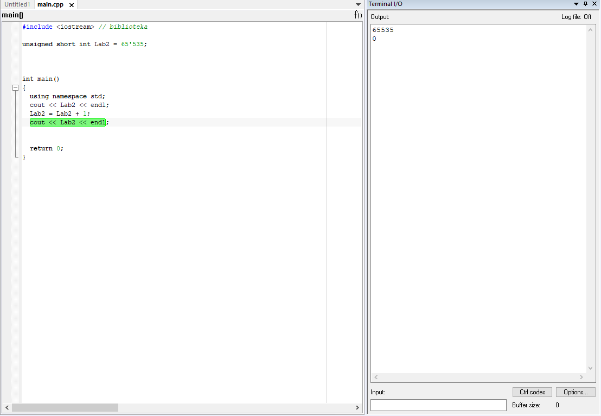
Нам нужно создать глобальную переменную типа unsigned short и присвоить ей значение 65535.
прибавить к данной переменной 1 - описать что получилось и почему.

Вывод: Произошла
потеря бит из-за того, что переменной не было выделено достаточно памяти для
хранения и произошло переполнение переменной.
В нашем случае переменная типа unsigned short может занимать 2 байта, а число 65536
уже занимает 3 байта.

.Работа программы с переменной signed short
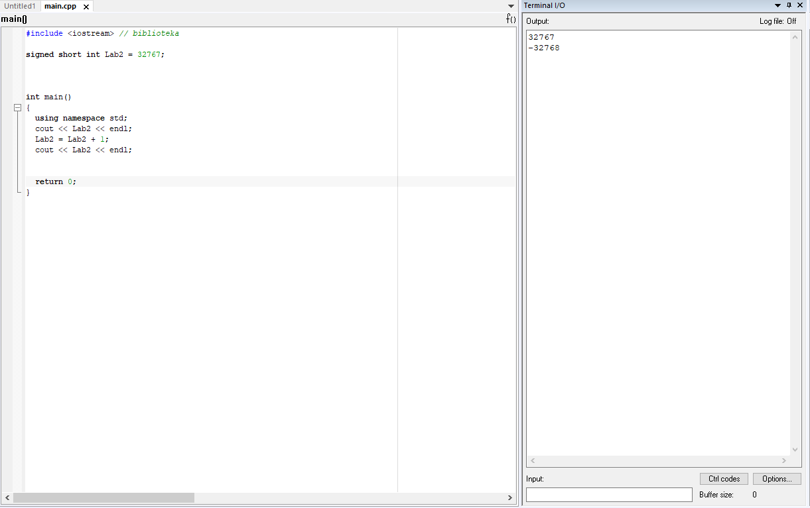
Поменять тип переменной на signed short и присвоить
ей значение 32767
В функции main прибавить к данной переменной 1

Вывод: случилось переполнение переменной, старший бит зарезервирован
под знак числа. После того как он заполнился, число превратилось в максимально
возможное отрицательное.

.Работа программы
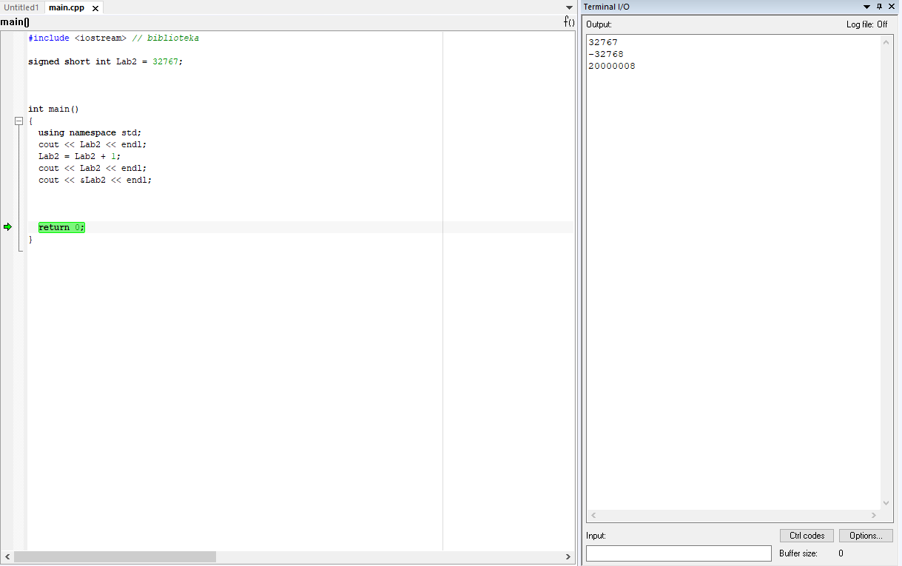
 Нам нужно не меняя тип переменной взять
адрес переменной и вывести адрес
переменной в терминал.

Вывод: мы сравнили между собой значения, полученные в окне теримнала и Watch. Как можем заметить, они совпадают.

.Результат
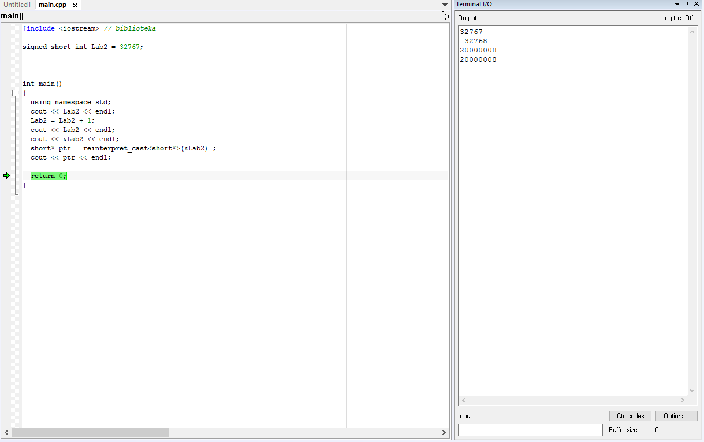
Далее, необходимо не меняя переменной выполнить явное преобразование адреса
переменной к типу указатель на short используя reinterpret_cast и присвоить локальной переменной типа short*.

.Работа программы
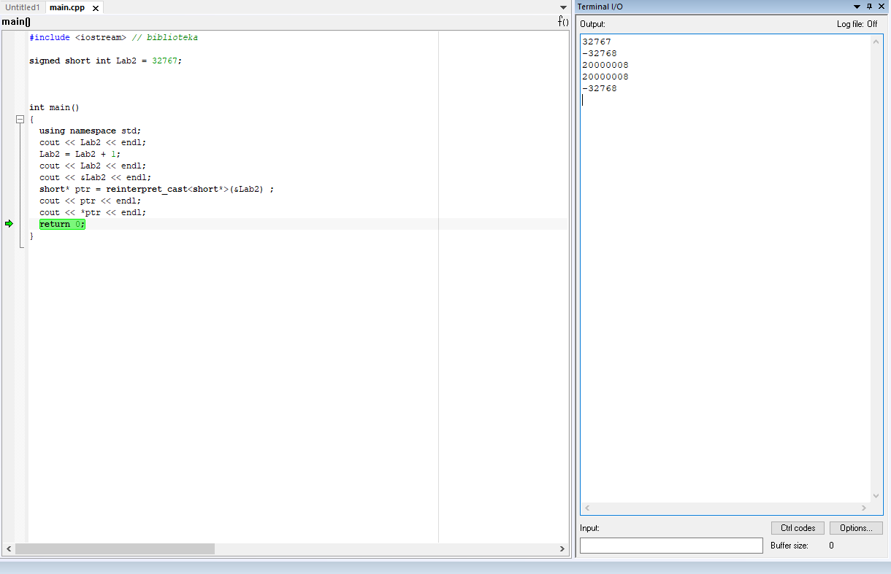
Вывод: После выполнения операций можно сделать вывод,
что адрес переменной и указатель, который хранит адрес этой переменной
равны между собой, так как signed short и short являются одним и тем же.

.Результат
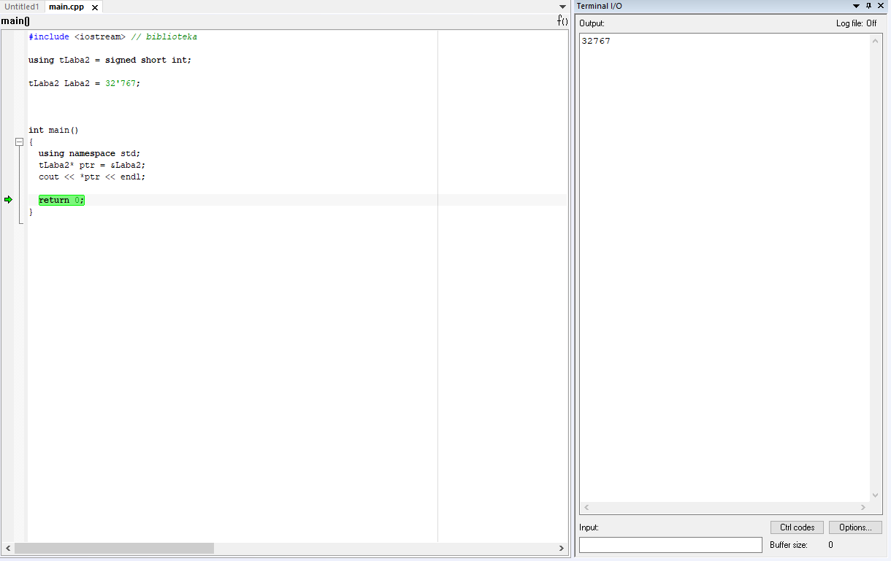
Посмотрим что у нас хранится по этому адресу.Заметим, что в данный момент по адресу 0x20000000 записано число 32 767 в

.Преобразование к типу int
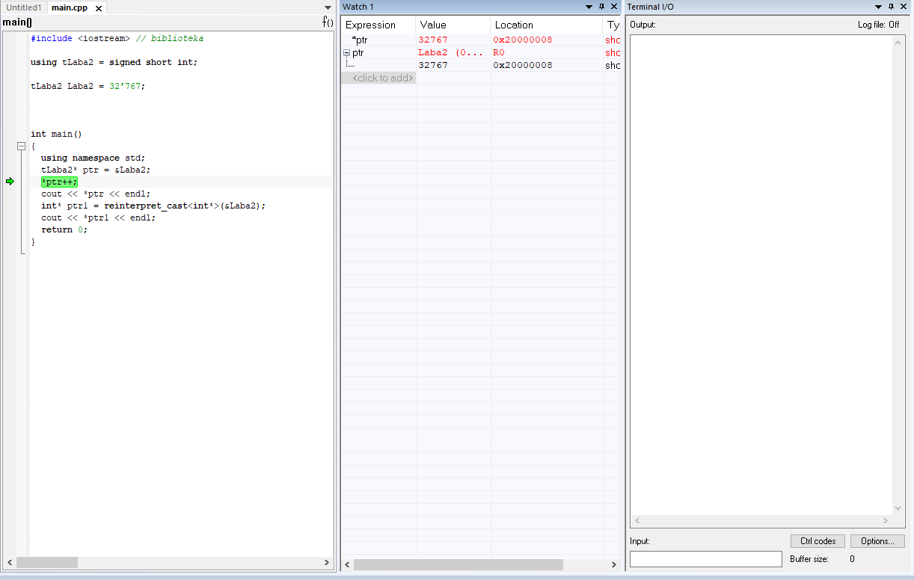
Произведём явное преобразование этого указателя
к типу указателя на int, разыменуем и выведем значение, лежащее по адресу указателя.

.Результат
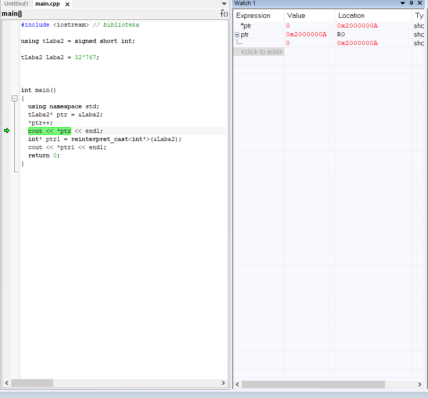
ВЫвод:Как можем заметить, *ptr изменилось с 32767 на 0, так как указатель стал
указывать на другую область памяти.

Значение ptr изменилось с 0x20000008 на 0x2000000A. Это произшло
потому что short - 2-байтовый тип переменной и
мы прибавили к восьмерке 2 и получилось 10.

.Работа с прграммой типа short
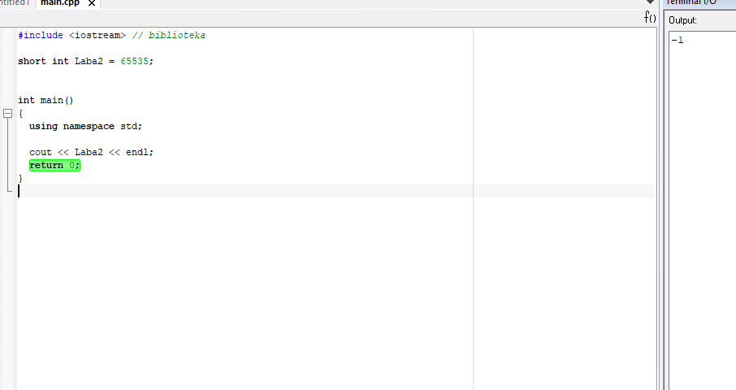
Необходимо заменить тип переменной с unsigned
short на short и присвоить ей значение 65 535.

Мы получили, что при изменении типа переменной на short со значением 65 535 в терминале получаем -1.
Это получается потому что наибольшее число, которое можно без переполнения положить - это 32 767. А число 65 535 = (32 767 + 1) + 32 767= -32 768 + 32 767 = -1
Далее нужно сделать явное преобразование типа к short и объяснить полученный результат. После добавления

.Явное преобразование типа к short
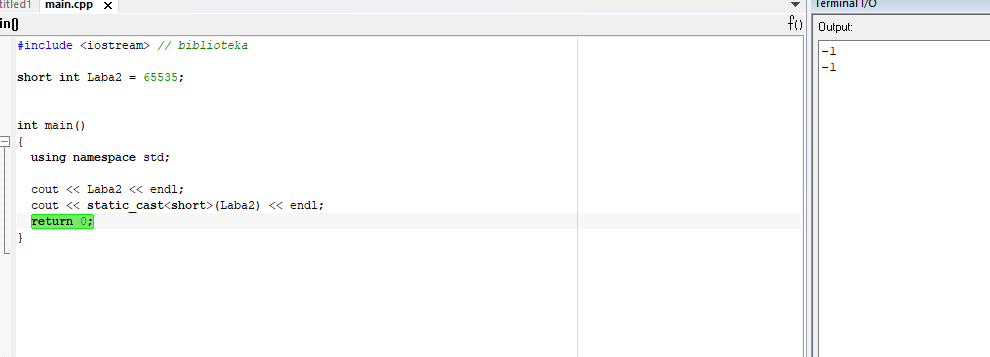

После явного преобразования мы получили такое же значение -1. Это произошло из-за того, что мы производим явное
преобразование к такому же типу данных, которым он был до преобразования.

.Работа программы
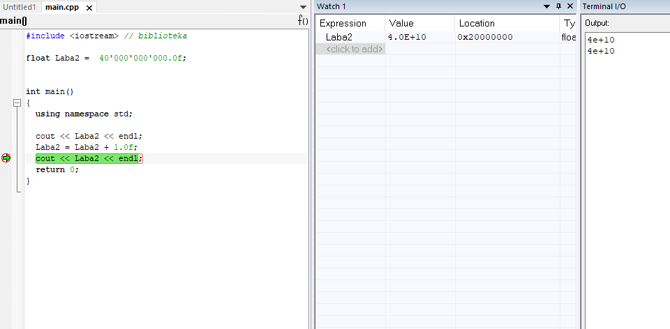
Следующим заданием было создание переменной типа float и присвоение ей значения 40'000'000'000F.
А также, прибавление единицы к этому значению и вывод в окно Watch.

Как можем заметить,
float не хватает точности, чтобы отобразить прибавленную нами единицу.
.Работа программы
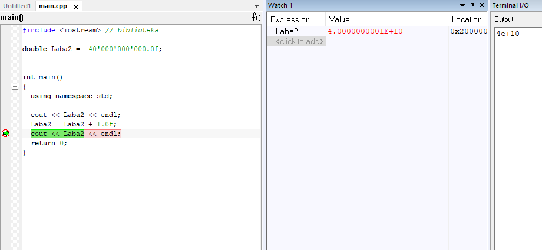
Отметим, что при смене типа данных переменной с float на double в окнах Watch и Terminal значения стали разными,
так как у double точность в два раза выше чем у float, единица отобразилась.